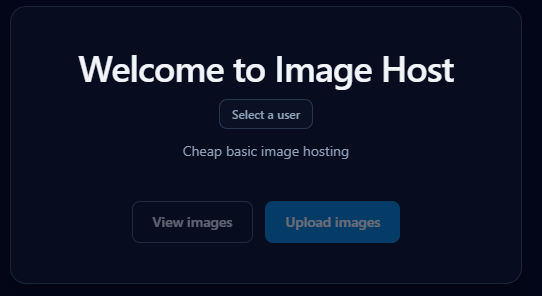
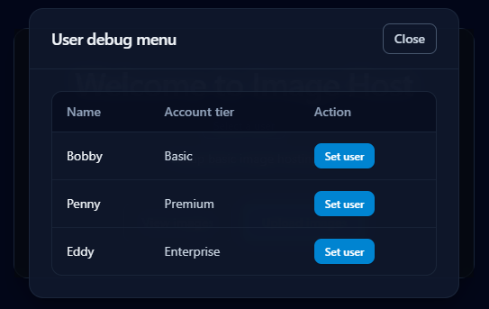
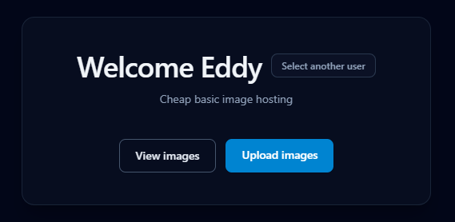
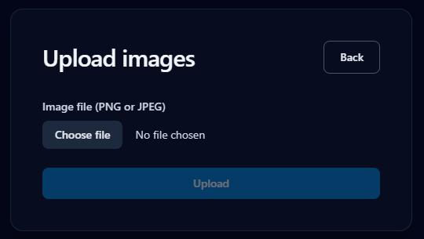
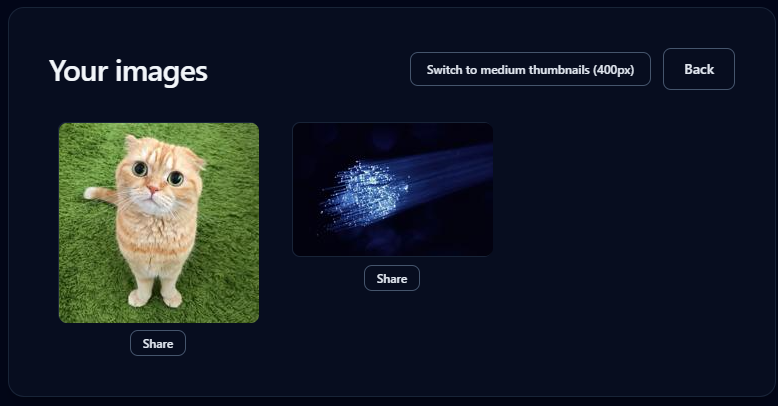

# Image Hosting App

This base for this codebase was adapted from the steps in [Modern JavaScript for Django Developers](https://www.saaspegasus.com/guides/modern-javascript-for-django-developers/).

This mini app allows the uploading and viewing of images and was created as a basic coding exercise.

This project can be run out of the box via Docker `docker-compose build` and then `docker-compose up`. This is meant to simulate how it could be deployed and allows easy startup without needing to handle dependencies. After starting up the container you will have access to it via http://localhost:8000/.

However, if you want to do active local development then you should instead run both the backend and frontend directly locally.

## Project setup

### Backend setup

Requires Python 3.14. This project was setup with UV, but other virtual environments should work. Just replace any instance of `uv run` with `python` in the instructions below.

- Install dependencies `uv sync` or `pip install pyproject.toml`
- Setup database `uv run manage.py migrate`
- Seed database `uv run manage.py seed` (this creates test users in the DB)
- Startup backend `uv run manage.py runserver`

You should now see your local server starting up under `localhost:8000`.

If you want to run tests, then they can be run via `uv run manage.py test`.

### Frontend setup

Requires node 24.14.1.

- Install dependencies `npm i`
- Run frontend server `npm run dev`

Your frontend should now be running. The URL it gives is unused as all routing goes via the backend under `localhost:8000`. It is only possible to view the frontend when Django is also running.

Tests are run via `npm run test`.

## Using Image Host

### User setup

When you first enter the website you'll be created with the following menu.

While auth and user registration were out of scope, I still decided to tie features of the app to invidiual users to simulate how it would work with many users of different types.

To start using it, you will need to click on the `Select a user` button. This will open the user debug menu shown below. If you cannot see any users, then check that you followed the setup steps above including the seeding of the database.

Each user has a separate ID and account tier for ease of testing. When you select `Set user` you will be redirected back to the main page. But the state will be updated and you will now be identified as that particular user. If you want to change user's later, then simply return the to the main screen and choose `Select another user`.

### Uploading images

After choosing a user, you can uploade images by clicking on the `Upload images` button.

After clicking that you are given the option to choose a file to upload. Assuming it was a valid image, you will get confirmation of the upload. You can continue uploading images here until you are satisfied.

You will be able to see the images as they have been uploaded and cropped in `dist/images` in the main repo.

### Viewing uploaded images

After choosing a user, you can view uploaded images by clicking on the `View Images`. If you have not already uploaded any images, then this will show a blank screen. However, once you upload some images as a user their thumbnails will appear here.

If you have chosen a basic account, then some of the buttons will be disabled and you will only be able to view 200px thumbnails. However if you chose Premium or Enterprise then you will see a button which allows you to request and switch to 400px thumbnails.

Additionally, Premium or Enterprise users can click on a thumbnail and will be shown a full resolution copy of the image. This can be dismissed by clicking again.

Finally, Enterprise users can create time limited share links. If you click on `Share` then it will give you a form to create a link which will expire in a given amount of seconds. This link redirects to the original image, unless it has expired in which case it gives a 404.

## Technical details

### API and Schema generation

The API schema is automatically generated via `uv run manage.py spectacular --file schema.yml`. And then frontend API client is generated from that schema via `npm run generate-api`.

### Missing details and things I'd change

This project is generally not ready for production. The Django settings are not configured appropriately, images can be accessed by any user since there's no auth check, and the lack of filtering/pagination means that the images list would probably fall over if enough images were uploaded and requested. Those are all relatively essential things to address this were to be expanded.

While not essential, if I had external resources I would definitely prefer to store image files on AWS rather than locally on the server. This would scaling easier, make access control simpler, and would let us leverage existing API features like expiring links for the share links.
